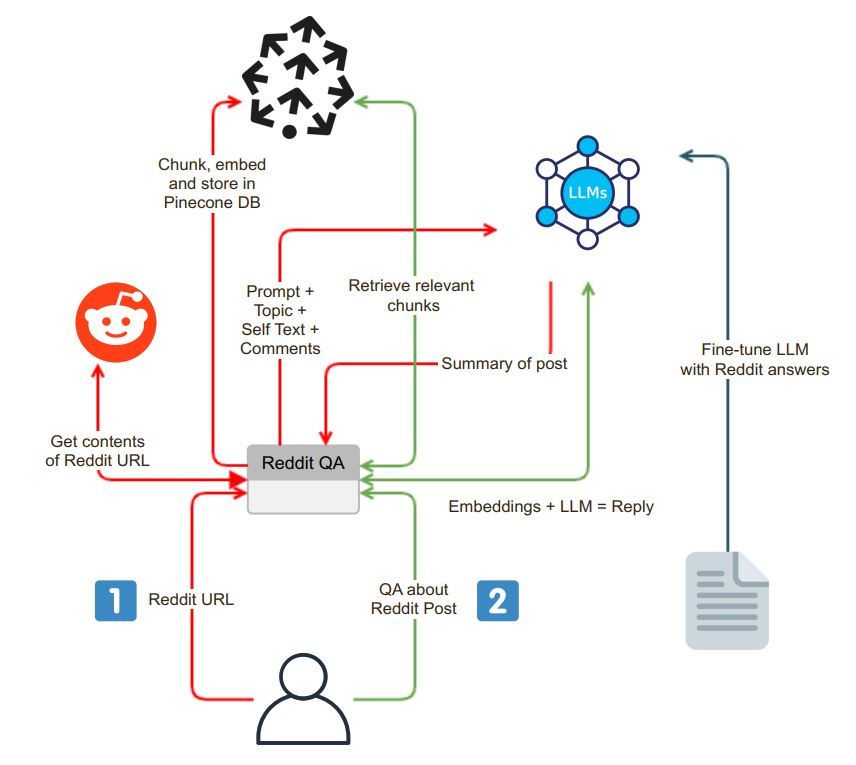

# Reddit Chat Interface


Welcome to the Reddit Post Summarizer Chat Interface. This Streamlit-based application allows users to extract and summarize content from Reddit URLs seamlessly and hold QA sessions. This is my first attempt at using LLMs with Vector DBs for QA, summarization, fine-tuning purposes. 



### Input and Content Extraction

The application initiates with a user-friendly chat interface. Users can enter a Reddit URL into the search box, and the system undertakes the following steps:

- **URL Validation**: The application verifies whether the entered URL belongs to Reddit.

- **PRAW Integration**: Upon successful URL validation, the Python Reddit API Wrapper (PRAW) is employed to extract the contents of the Reddit post. This includes the self text and comments associated with the post.

- **Data Chunking and Embedding**: The retrieved self text and comments are broken into smaller, digestible segments (chunks). Each chunk is then embedded, and the embeddings are stored in a vector database, Pinecone. This step is essential for efficient and quick data retrieval.

### Summarization

Following the extraction and embedding process, the application generates a summary of the Reddit post using a Language Model (LLM) such as OpenAI GPT-3.5. The summarization process can be broken down into the following steps:

- **Chunk Generation**: A text chunk of suitable size is generated by recursively summarizing chunks until it fits the token limit of the LLM.

- **LLM Model Interaction**: A summarizing prompt is sent to the LLM model, which subsequently returns a concise summary of the post. This summary captures the essence of the Reddit content.

### Chat Interface and Interactive Q&A

The application provides a chat interface where users can interact with the system and ask questions about the Reddit post. The chat interface has some distinct features:

- **Contextual Question Processing**: When a user asks a question, the system embeds the question and searches the vector database for context similarity. It fetches the relevant context and appends it to the user's question as part of the prompt.

- **Answer Generation**: This extended prompt is then sent to the LLM model, which produces a detailed and context-aware answer.

- **Model Fine-Tuning**: To ensure that the answers are Reddit-style, the LLM model can be fine-tuned with Reddit question-answer pairs, delivering responses that align with Reddit's community language.

### Model Selection

One of the unique features of the application is the ability for users to choose the Language Model they want to use. This flexibility is facilitated by Langchain, a tool that allows the application to seamlessly switch between different LLM models according to user preferences.

## Getting Started
1. OpenAI API Key:You will need an OpenAI API Key to use the GPT models. Add the key to .env.example file.
2. Pinecone API Key: Add the Pinecone API key to .env.example file.
3. Get Reddit PRAW credentials as listed in the .env.example file.
4. Execute the following code to get started.
```bash
cp .env.example .env
docker build -t reddit-gpt .
docker run -d --env-file .env -p 8501:8501 reddit-gpt
```
